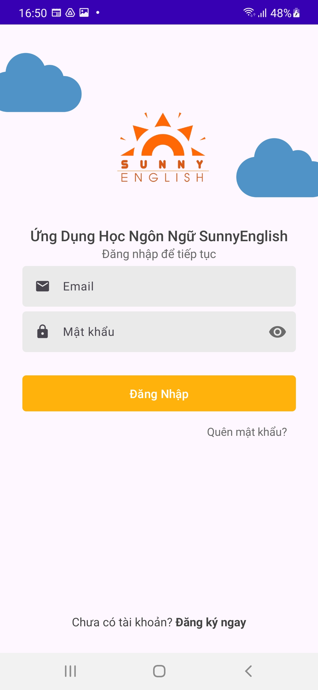
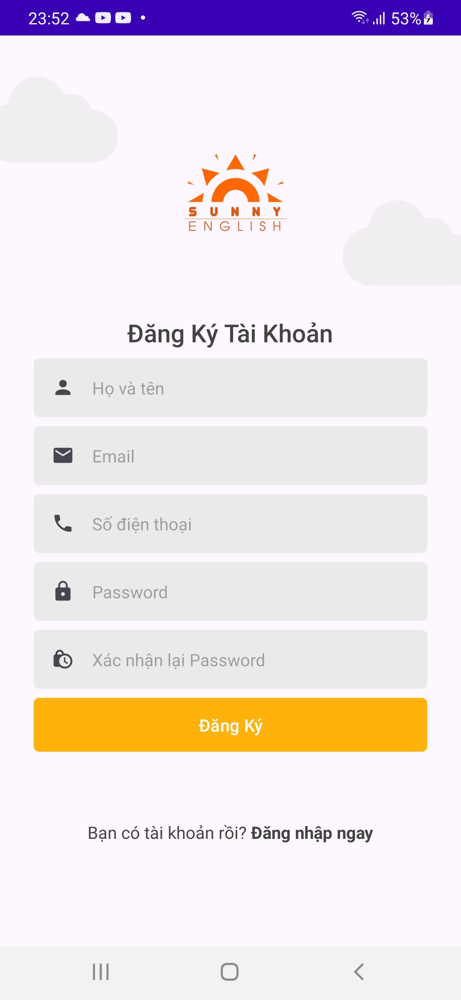
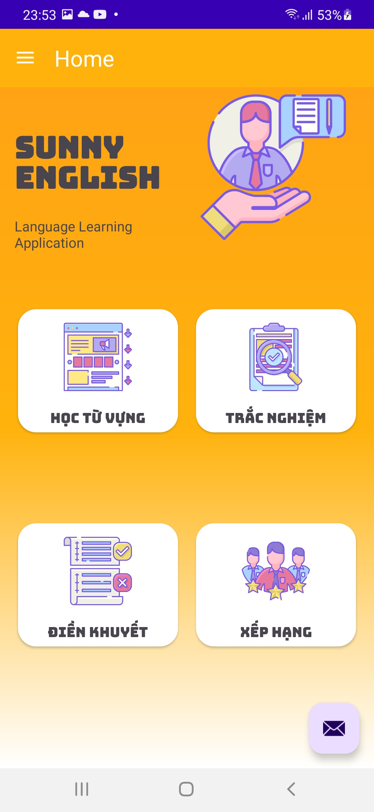
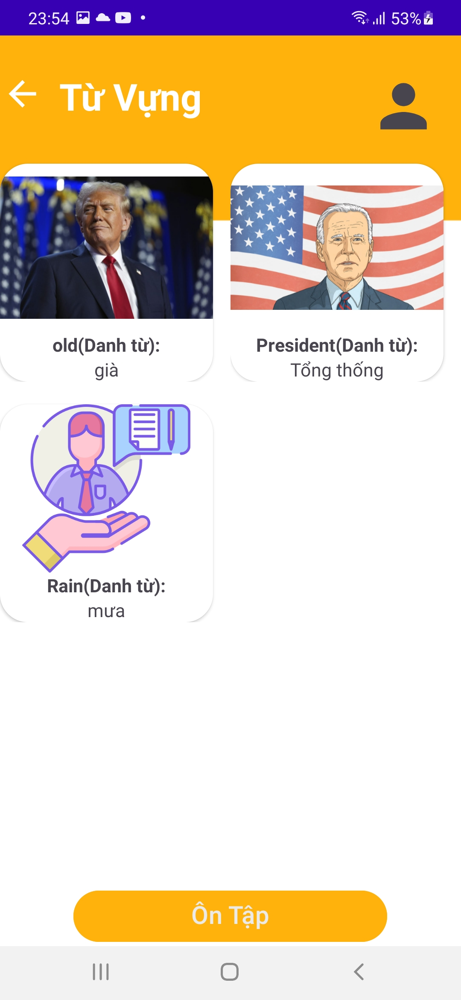
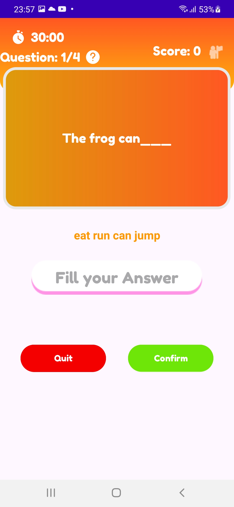
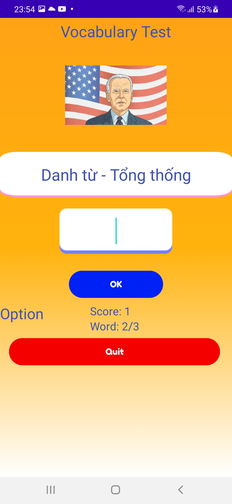
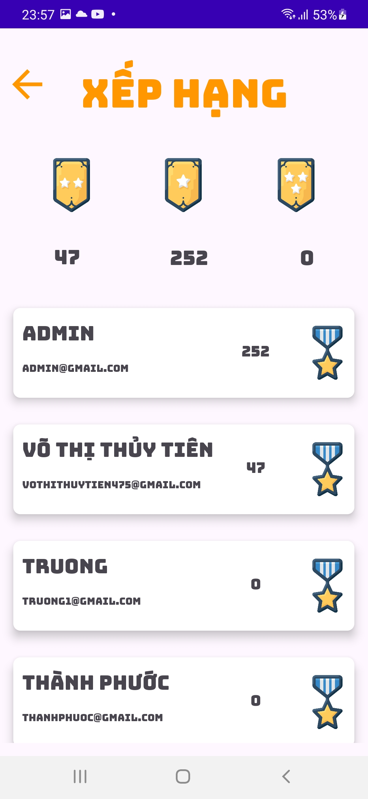

# 🌍 LanguageApp - Ứng dụng Học Đa Ngôn Ngữ 

[//]: # (Thêm ảnh minh họa tại đây)


## 🚀 Giới thiệu
SunnyEnlish là một ứng dụng giúp bạn học và thực hành nhiều ngôn ngữ khác nhau một cách trực quan và hiệu quả. Với các công cụ hỗ trợ thông minh, việc học ngôn ngữ chưa bao giờ dễ dàng hơn.

## 🔥 Tính năng nổi bật
- 📚 **Học từ vựng** với hình ảnh minh họa và có bài kiểm tra để ôn tập.
- 💬 **Luyện tập điền vào chỗ trống,** giúp cải thiện kỹ năng viết và sử dụng từ vựng trong ngữ cảnh thực tế.
- 🎯 **Kiểm tra bằng câu hỏi trắc nghiệm** hỗ trợ đánh giá mức độ tiến bộ của bạn và củng cố kiến thức đã học.
- 🌎 **Hỗ trợ nhiều ngôn ngữ**, từ tiếng Anh, tiếng Pháp, đến tiếng Nhật và hơn thế nữa!
## ⚙️ Chức năng Quản lý
Ứng dụng hỗ trợ các thao tác quản lý:
- ➕ **Thêm** bộ học tập, từ vựng, câu điền khuyết, câu trắc nghiệm mớ.
- ✏️ **Chỉnh sửa** thông tin của bộ học tập, từ vựng, câu điền khuyết, câu trắc nghiệm hiện có.
- 🗑️ **Xóa** nội dung không còn cần thiết để tối ưu hóa dữ liệu.
## 🗄️ Quản lý Dữ Liệu
Ứng dụng sử dụng Firebase Realtime Database để lưu trữ và quản lý dữ liệu học tập theo cấu trúc phân cấp, đảm bảo hiệu suất cao và truy cập nhanh.
```json
{
  "BoHocTap": {
    "idBo1": {
      "idBo" : idBo1
      "tenBo": "Bộ học tập số 1",
      "stt": "1"
    }
  },
  "TracNghiem": {
    "idCau1": {
      "idBoHocTap": "idBo1",
      "noiDung": "Nội dung",
      "dapanA": "go",
      "dapanB": "went",
      "dapanC": "going",
      "dapanD": "gone",
      "dapAnTrue": "2"
    }
  },
  "DienKhuyet": {
    "idCau1": {
      "idBoHocTap": "idBo1",
      "noiDung": "I ____ to the market yesterday.",
      "goiY": "went go run walk",
      "dapAn": "went"
    }
  },
  "TuVung": {
    "idTu1": {
      "idBoTuVung": "idBo1",
      "tu": "hello",
      "dichnghia": "Xin chào",
      "loaitu": "Danh từ",
      "anh": "URL_Hinh_Anh"
    }
  }
}
```
## 📷 Ảnh chụp màn hình
## 📷 Ảnh chụp màn hình

<p align="center">
   
  
</p>

<p align="center">
   
  
</p>

<p align="center">
   
  
</p>

<p align="center">
   
  
</p>

<p align="center">
   
  
</p>

<p align="center">
   
</p>


## 🛠 Cài đặt
Dễ dàng cài đặt ứng dụng bằng cách:
```sh
git clone https://github.com/yourusername/LanguageMaster.git
cd LanguageMaster
npm install
npm start
